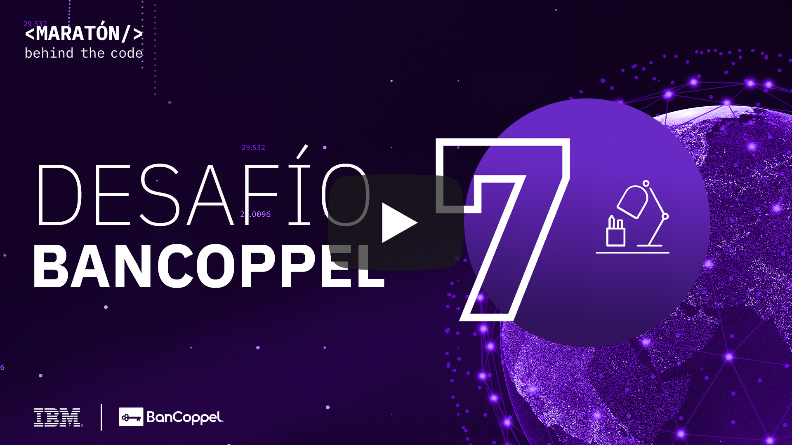
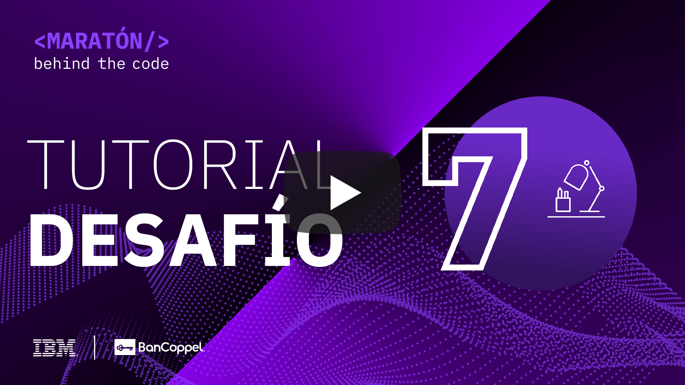
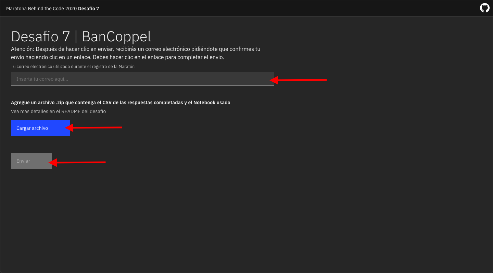

# Desafio 07 | BanCoppel

- [1. Acerca de BanCoppel](#1-acerca-de-bancoppel)
- [2. Reto de negocio](#2-reto-de-negocio)
- [3. Objetivo](#3-objetivo)
- [4. Desarrollando la solución](#4-desarrollando-la-solución)
  - [4.1. La tecnología del reto](#41-la-tecnología-del-reto)
  - [4.2. Pre-requisitos](#42-pre-requisitos)
  - [4.3. Resumen de las tareas](#43-resumen-de-las-tareas)
  - [4.4. Desarrollo](#44-desarrollo)
- [5. Envío](#5-envío)
- [6. Sobre la evaluación](#6-sobre-la-evaluación)

## Para Ayudarte

- [Material de apoyo](#material-de-apoyo)
- [Solución de problemas](#solución-de-problemas)
- [Licencia](#licencia)

## 1. Acerca de BanCoppel

BanCoppel -Institución de Banca Múltiple,  es un banco mexicano que ofrece servicios bancarios completos, como depósitos, préstamos, administración de activos, tarjetas de crédito, pagos en línea y contratos de fideicomisos, entre otros.

Entre muchas otras cosas BanCoppel, busca ofrecer a la población de bajos ingresos los servicios bancarios que les permitan administrar mejor sus recursos a través del tiempo, así como desarrollarse, planear mejor su futuro, enfrentar imprevistos y disminuir riesgos.

    

## 2. Reto de negocio

BanCoppel busca comprender mejor quién usa su aplicación móvil y de qué manera interactúa, para hacerla más atractiva para todos y así lograr el objetivo de BanCoppel de tener una aplicación a la medida para sus clientes.

## 3. Objetivo

BanCoppel tiene mucha información sobre los usuarios de su aplicación móvil y le gustaría comprender mejor quiénes son. El participante debe desarrollar un modelo de Machine Learning capaz de comprender, a partir de los datos aportados, cuál es el perfil de cada cliente bancario.

En este desafío, BanCoppel usará herramientas de IBM como [Watson Studio (o Cloud Pack for Data)](https://cloud.ibm.com/catalog/services/watson-studio) para construir un modelo de Machine Learning.

La idea fundamental del desafío 7 es crear un modelo de Machine Learning capaz de identificar el perfil de los clientes del banco para personalizar la experiencia de los clientes actuales y futuros.

## 4. Desarrollando la solución

En este desafío vamos a usar las siguiente herramienta

[Watson Studio](https://cloud.ibm.com/catalog/services/watson-studio) proporciona un conjunto de herramientas y un entorno colaborativo para científicos de datos, desarrolladores y expertos en dominios. Es un ambiente de desarrollo (IDE) web que combina herramientas Open Source con tecnología de IBM para desarrollar modelos de Machine Learning y Deep Learning.

### 4.1. La tecnología del reto

Mira el tutorial a continuación para aprender como aplicar la tecnología de IBM para resolver el desafío

    

### 4.2. Pre-requisitos

Para poder realizar este desafío, se deben cumplir con los siguientes requisitos previos:

- Estar registradro en la [Maratón Behind the Code](https://maratona.dev/es) y confirmar el e-mail de registro.
- Tener una cuenta en [IBM Cloud](https://ibm.biz/registro-maratona), que puede ser una cuenta GRATUITA o de pago (no es necesario registrarse en el evento con el mismo correo electrónico utilizado para crear su cuenta IBM Cloud).

### 4.3. Resumen de las tareas

1. Cree el servicio [Watson Studio (Cloud Pak for Data as a Service)](https://cloud.ibm.com/catalog/services/watson-studio) en IBM Cloud. (Si ya lo creo en el desafío 2 no es necesario volverlo a crear)
2. Cree el servicio [Cloud Object Storage](https://cloud.ibm.com/catalog/services/cloud-object-storage) (Si ya lo creo en el desafío 2 no es necesario volverlo a crear)
3. [Crear un nuevo proyecto vacío en Watson Studio](https://dataplatform.cloud.ibm.com/projects/new-project?context=cpdaas)
4. Importar el notebook usando el archivo `notebook.ipynb`
5. Leer y ejecutar las instrucciones contenidas en el Notebook `notebook.ipynb`
6. Guarde el csv como results.csv con sus predicciones y el notebook que desarrolló `notebook.ipynb`
7. Envíe su solicitud a [https://bancoppel.maratona.dev/](https://bancoppel.maratona.dev/)

### 4.4. Desarrollo

El participante trabajará con un conjunto de datos sintéticos proporcionados para crear un modelo que realice la predicción del perfil del usuario. Usando este modelo el participante debe producir un archivo csv con los resultados.

En este repositorio encuentra el notebook necesario para crear proyecto completo en Watson Studio ya con una solución básica lista, totalmente funcional. Puede (y se recomienda) mejorar el modelo para obtener una mayor puntuación.

## 5. Envío

Para hacer la entrega, debes acceder a la siguiente página: [https://bancoppel.maratona.dev/](https://bancoppel.maratona.dev/) y cargar un archivo zip con el archivo csv results.csv con los resultados de su predicción y el notebook que desarrolló `notebook.ipynb`.

**Si cambia el nombre o formato del archivo csv su solución no será evaluada**

**Si cambia el nombre del notebook su solución no será evaluada**

Después de cargar su archivo haga clic en el botón en la esquina inferior derecha para ENVIAR su solución, como se muestra en la imagen a continuación, y complete el formulario con su dirección de correo electrónico utilizada de la inscripción en MARATÓN 2020.

Enviar:

</img>

## 6. Sobre la evaluación

La idea fundamental del desafío 7 es crear un modelo de Machine Learning capaz de identificar el perfil de los clientes de BanCoppel. En esencia, el reto puntuará la respuesta de su modelo en un archivo csv. En esta ocación se hara una prueba basada en el _F1 Score_, que mide tanto la presición como el recall.

La rapidez de entrega no se incluye en el cálculo de la puntuación del desafío. Sin embargo, para todos los participantes que presenten este desafío en la primera semana después del lanzamiento, recibirán una bonificación del 10% en la puntuación final de la entrega.

Recuerde que tiene 3 oportunidades de envío de la solución del reto donde se le tomará en cuenta el envío que obtenga mejor puntuación.

## Material de apoyo

- [Video Watson Studio](https://www.youtube.com/watch?v=BecC1U5PJT4)
- [Una guía del portal de IBM Developer para principiantes del Machine Learning](https://developer.ibm.com/es/patterns/use-icp4d-to-build-the-machine-learning-model-for-return-propensity/)
- [Watson Studio Docs](https://dataplatform.cloud.ibm.com/docs/content/?context=cpdaas)

## Solución de problemas

Mira el [video explicativo](#4-desarrollando-la-solución) provisto en la Sección 4, o si lo deseas, revisa la documentación de los servicios involucrados en este desafío.

> Si ya consumio todo su plan gratuito de Watson Studio puede crear otra cuenta de [IBM Cloud](https://ibm.biz/registro-maratona) con otro correo.

Accede al discord oficial de la Maratón 2020 para hacer preguntas y/o interactuar con otros participantes: [Discord](https://discord.gg/Q9At74C).

## Licencia

Copyright 2020 Maratona Behind the Code

Licensed under the Apache License, Version 2.0 (the "License");
you may not use this file except in compliance with the License.
You may obtain a copy of the License at

       http://www.apache.org/licenses/LICENSE-2.0

Unless required by applicable law or agreed to in writing, software
distributed under the License is distributed on an "AS IS" BASIS,
WITHOUT WARRANTIES OR CONDITIONS OF ANY KIND, either express or implied.
See the License for the specific language governing permissions and
limitations under the License.
